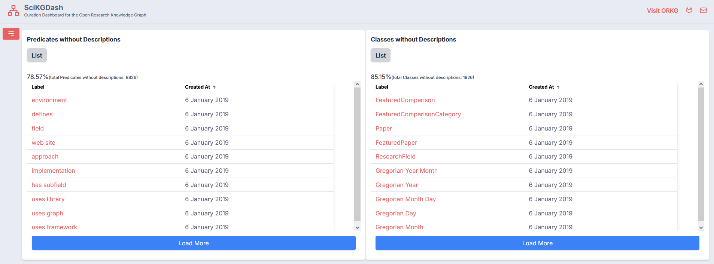
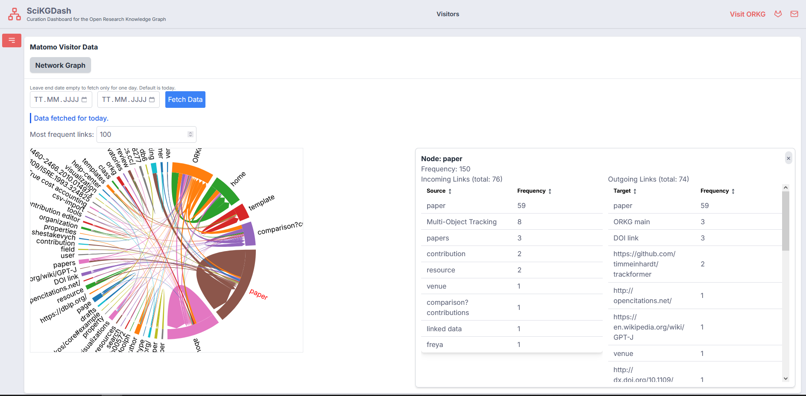

# SciKGDash Curation Dashboard

**SciKGDash** is an interactive dashboard designed to support quality assurance and curation workflows in **Research Knowledge Graphs (KGs)**—particularly the [Open Research Knowledge Graph (ORKG)](https://www.orkg.org/). It enables curators and data managers to explore, validate, and improve the quality of scholarly knowledge representations.

The **Open Research Knowledge Graph (ORKG)** aims to represent the content of research papers in a structured, machine-readable form. It facilitates the comparison of scholarly contributions (e.g., methods, results, datasets) across research papers, enabling advanced search, reasoning, and discovery.

### 📉 What does SciKGDash do?

Designed for curators, and platform developers, SciKGDash provides **interactive pages with tailored components** that surface key performance indicators (KPIs) about data quality, usage, and content coverage.

By offering insights into both **structural integrity** (e.g., missing descriptions, schema usage) and **visitor behavior** (e.g., navigation patterns), SciKGDash helps teams identify curation needs, guide platform improvements, and benchmark progress over time.

#### Dashboard Highlights

Each page in SciKGDash focuses on a different aspect of quality assurance and platform usage:

Tabs (selected examples):

- Overview: High-level quality metrics such as missing labels or underused classes — useful for comparing with other KGs.

- Visitors: Behavioral insights powered by Matomo, revealing how users navigate ORKG (e.g., popular pages, common paths).

- Insights: ORKG-specific indicators like the number of statements per paper — showing how richly each paper is described.

More screenshots can be found [here](review).

### ❓ Why the Need for a Curation Dashboard?

The _curation of research knowledge graphs_ (RKGs) remains a largely underexplored challenge. While **human curation** ensures high-quality, semantically rich data, it is time-consuming, resource-intensive, and difficult to scale—especially in dynamic and complex domains like scholarly communication.

**Automated approaches** often fall short of expert-level accuracy, struggling with ambiguity, nuance, and evolving domain knowledge. This creates a growing need for tools that can **support human curators**, offering actionable insights into data quality, completeness, and usage patterns.

**SciKGDash** addresses this gap by providing a transparent, metric-driven interface that enables curators to:

- Detect issues and inconsistencies at scale

- Prioritize curation efforts based on impact

- Monitor improvements over time

- Understand how the KG is used in practice

By bridging the gap between full automation and manual oversight, SciKGDash supports sustainable KG curation.

### Installation Instructions

SciKGDash can be run using either **Docker** or a **local development environment**. Choose the setup that fits your workflow:

#### 🐳 Option 1: Run with Docker (recommended)

1. Configure frontend environment
   Update the `.env` file in the frontend directory based on your environment: - If both backend and frontend run in Docker:
   `NEXT_PUBLIC_BACKEND_URL=http://scikgdash-backend:8001`
   If you run the frontend locally:
   `NEXT_PUBLIC_BACKEND_URL=http://localhost:8001`
2. Start containers
   `docker compose up -d` in the root directory
   If you only want to run the backend in Docker:
   `docker compose up -d backend`
3. Access the dashboard at http://localhost:3000

#### 💻 Option 2: Run frontend and backend locally

Note: You can run the frontend without the backend if you don't want to access the comments functionality.

1.  Backend (Python 3.10):

        cd scikgdash-backend
        python3 -m venv venv
        source venv/bin/activate
        pip install -r requirements.txt
        python main.py

2.  Frontend (Node.js):

        cd frontend
        npm install
        npm run dev

##### 🔒 Visitor Analytics (Optional)

To enable visitor analytics from Matomo, certain environment variables are required. These are currently internal to the ORKG team. Contact info@orkg.org for access and configuration help.

### Project Structure

**SciKGDash** consists of a frontend built with Next.js and a lightweight Python backend to manage a database. The repository is organized as follows:

    .
    ├── .env                       # Frontend environment config
    ├── app/                       # Main application logic and routing
    │   ├── [page]/                # Page folders for each dashboard view (Overview, Visitors, etc.)
    │   │   ├── [layout].tsx         # layout and navigation
    │   │   └── page.tsx           # Root page
    │   ├── components/            # Reusable UI components (tables, diagrams)
    │   ├── styles/                # Tailwind/global styles
    │
    ├── scikgdash-backend/         # Python FastAPI backend
    │   ├── main.py                # Entry point for the API
    │   ├── requirements.txt       # Python dependencies
    │   └── .env                   # Backend-specific environment config
    |   └── db/                    # folder for database-specific config
    |   |   └──...
    │
    ├── compose.yml                # Docker setup for frontend + backend
    └── README.md                  # Project documentation
